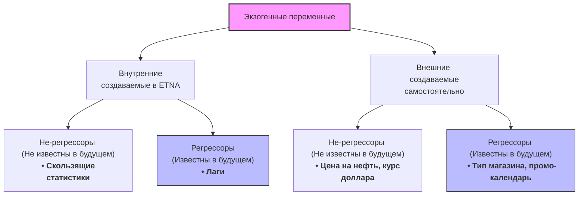

# Справочник по базовым моделям прогнозирования (ETNA)

## 📌 Базовые понятия

При работе с временными рядами:
1. Мы всегда смотрим в прошлое. Но смотрим по-разному:
   * **Лаг (Lag / Сдвиг / Опоздание)** — отвечает на вопрос **«Откуда начинаем смотреть?»**. Это временное расстояние между моментом, на который мы строим прогноз, и самой свежей доступной точкой реального факта. Пример: Находясь в точке «пятница 12:00», мы хотим предсказать «субботу 12:00». Минимальный лаг равен 24 часам (данные из будущего нам недоступны).
   * **Окно (Window / Глубина истории)** — отвечает на вопрос **«Сколько точек берем?»**. Это количество исторических элементов, которые мы собираем вместе *после* отступа на лаг, чтобы рассчитать метрику (например, среднее арифметическое).

2. Называем переменные правильно:
   * **Эндогенные** — целевые переменные, прогнозируемые временные ряды, которые получают название `target`.
   * **Экзогенные** — все переменные (признаки), кроме целевых которые помогают спрогнозировать `target`. Делятся на два типа:
     * **значения которых будут известны в будущем** — регрессоры 
     * **значения которых будут не известны в будущем**
     
     Например. Лаг - регрессор, так как последние значения лага станут значениями в тестовой выборке новых данных. А скользящая статистика не является регрессором. Чтобы значения скользящей статистики можно было использовать в тестовой выборке новых данных, ее нужно взять с лагом и тогда она станет регрессором.  

## 📋 Модели

### 1. MovingAverageModel

`MovingAverageModel` — наивная базовая модель простого скользящего среднего. Является дочерним классом от `SeasonalMovingAverageModel`, в котором сезонность заблокирована на значении 1.

* **Параметры:**
  * `window` *(по умолчанию 5)* — количество последовательных исторических точек для расчета среднего.
  * `seasonality` *(жестко зашита = 1)* — обычное несезонное среднее. Изменить при вызове нельзя.

* **Важные нюансы использования:**
  * **Рекурсивный каскад ошибок:** Модель прогнозирует много шагов вперед авторегрессионным методом (каждый новый шаг опирается на только что сделанные прогнозы). Если первая точка предсказана неверно, ошибка лавинообразно исказит весь дальнейший хвост («прогноз прогноза»).
  * **Золотое правило:** Чтобы модель всегда опиралась только на твердый исторический факт, должно соблюдаться условие:
    $$\large \text{Минимальный сдвиг (Lag)} \ge \text{Горизонт прогноза (Horizon)}$$

---

### 2. SeasonalMovingAverageModel

`SeasonalMovingAverageModel` — модель сезонного скользящего среднего. Умеет циклически перешагивать через определенные промежутки времени (сезоны).

* **Параметры «на пальцах»:**
  * `seasonality` *(обязательный)* — шаг сезонного цикла (гранулярность). Направляет фокус модели **только на аналогичные точки** в прошлом (например, строго в 12:00 каждого дня при `seasonality=24`), полностью игнорируя соседние часы.
  * `window` *(по умолчанию 5)* — количество таких аналогичных точек (дней) из прошлого, по которым будет считаться среднее. При `window=3` модель возьмет этот час за последние 3 дня.

* **Важные нюансы использования:**
  * **Формула окна под капотом:** Прыгает назад во времени с шагом сезонности:
    $$\large \text{Окно} = [t - \text{Lag}, \,\, t - \text{Lag} - \text{Seasonality}, \,\, t - \text{Lag} - 2\cdot\text{Seasonality}, \dots]$$
  * **Цикличный занос:** Если горизонт прогноза (`Horizon`) превышает значение `Seasonality`, модель гарантированно начнет использовать свои собственные предсказания (например, с 25-го часа при суточной сезонности).
  * **Золотое правило:** Для защиты от авторегрессионного заноса удерживайте баланс по формуле:
    $$\large \text{Минимальный сдвиг (Lag)} \ge \text{Горизонт прогноза (Horizon)} - \text{Сезонность (Seasonality)}$$