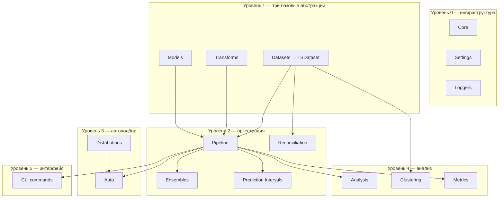

# Карта библиотеки ETNA

## Уровень 0 — Инфраструктура

Пронизывает всю библиотеку

- [Core](https://docs.etna.ai/stable/api_reference/core.html) — общие миксины: сохранение/загрузка, базовые интерфейсы.
  Именно отсюда «единый интерфейс» — каждый Transform/Model/Pipeline его наследует.
- [Settings](https://docs.etna.ai/stable/api_reference/settings.html) — флаги наличия опциональных зависимостей (torch,
  prophet, catboost и т.д.) — почему `etna[all]`, а не просто `etna`.
- [Loggers](https://docs.etna.ai/stable/api_reference/loggers.html) — интеграции с трекерами экспериментов (WandB,
  ClearML, S3).

## Уровень 1 — Три базовые абстракции

- [Datasets](https://docs.etna.ai/stable/api_reference/datasets.html) → `TSDataset` — структура данных: темпоральная
  индексация, работа с pandas, `.describe()`, `.make_future()`, экзогенные переменные, иерархия рядов.
- [Transforms](https://docs.etna.ai/stable/api_reference/transforms.html) — единый интерфейс
  `fit/transform/inverse_transform`, знает о темпоральной структуре. Подкатегории: decomposition (тренд/сезонность),
  missing_values (импутация), outliers, encoders, math, timestamp, embeddings, feature_selection.
- [Models](https://docs.etna.ai/stable/api_reference/models.html) — адаптер поверх сторонних библиотек (statsmodels,
  prophet, catboost, sklearn, pytorch) с единым интерфейсом `fit/forecast/predict`.

## Уровень 2 — Оркестрация (объединяет три абстракции в рабочий процесс)

- [Pipelines](https://docs.etna.ai/stable/api_reference/pipeline.html) — буквально `Transforms + Model` в одном
  объекте (`Pipeline`, `AutoRegressivePipeline`, `HierarchicalPipeline`).
- [Ensembles](https://docs.etna.ai/stable/api_reference/ensembles.html) — комбинирует несколько `Pipeline`
  (`VotingEnsemble`, `StackingEnsemble`, `DirectEnsemble`).
- [Prediction Intervals](https://docs.etna.ai/stable/api_reference/prediction_intervals.html) — надстройка над
  прогнозом `Pipeline`/`Model`, добавляет доверительные интервалы (Conformal, Empirical, NaiveVariance).
- [Reconciliation](https://docs.etna.ai/stable/api_reference/reconciliation.html) — согласование прогнозов по
  иерархической структуре `TSDataset` (BottomUp/TopDown).

## Уровень 3 — Автоподбор (работает над Pipeline)

- [Auto](https://docs.etna.ai/stable/api_reference/auto.html) — классы `Auto`/`Tune` перебирают `Pipeline` целиком
  или гиперпараметры внутри него.
- [Distributions](https://docs.etna.ai/stable/api_reference/distributions.html) — пространства поиска
  гиперпараметров, которые потребляет `Auto`.

## Уровень 4 — Анализ и интерпретация (потребляют TSDataset/Model/Pipeline, отдают инсайт человеку)

- [Analysis](https://docs.etna.ai/stable/api_reference/analysis.html) — визуализации, EDA, важность признаков.
- [Clustering](https://docs.etna.ai/stable/api_reference/clustering.html) — группировка похожих рядов внутри
  `TSDataset` (DTW/евклидово расстояние).
- [Metrics](https://docs.etna.ai/stable/api_reference/metrics.html) — численная оценка качества прогноза (MAE, SMAPE
  и т.д.).

## Уровень 5 — Пользовательский интерфейс

- [CLI commands](https://docs.etna.ai/stable/api_reference/commands.html) — обёртка `Pipeline` для запуска без
  Python (`backtest`, `forecast`).

## Песочница

- [Experimental](https://docs.etna.ai/stable/api_reference/experimental.html) — то, что ещё не стабилизировано:
  сейчас там `classification` (гл.29 книги) и `change_points`.
